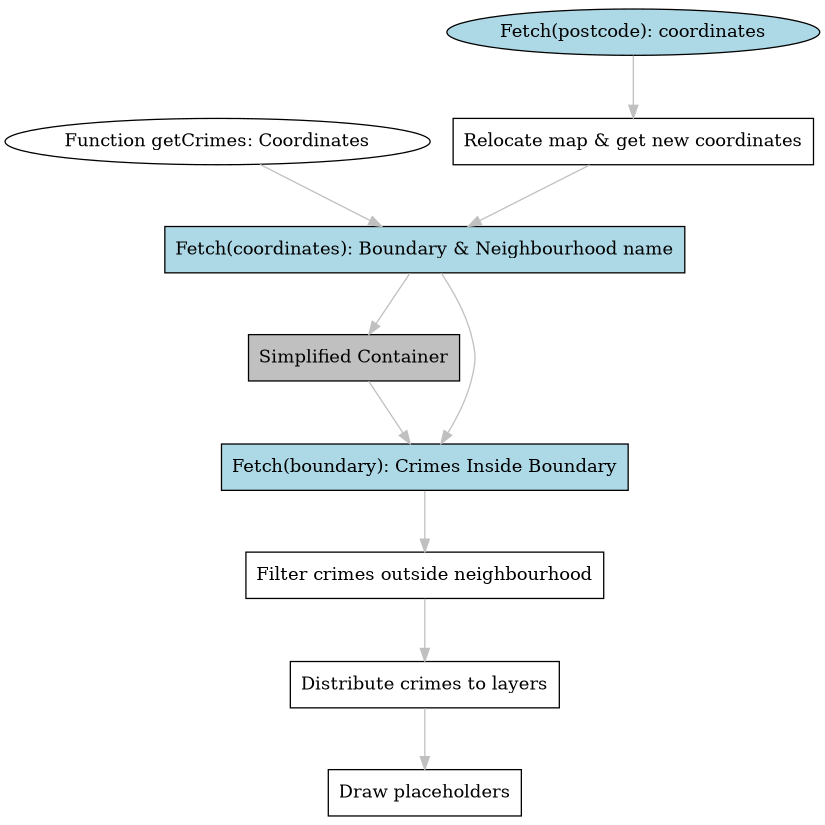

# UK Crimes

## Project Overview

UK Crimes provides users with real crime data based on their selected location and date. Users can input a postcode to zoom into a specific location and select a date to view crimes recorded for that month. The app fetches data from the UK police API and visualizes the crimes on a map with distinct markers based on crime categories.

<div align="center">

</div>

## Features

* Dynamic Map Visualization: View crimes on a map with distinct markers.
* Postcode Search: Input a postcode to zoom into a specific location.
* Date Selection: Choose a specific month to view the crimes recorded for that period.
* Responsive Design: The app is designed to be responsive and works across various device sizes.
* Spinning Crosshair: A visual indicator that shows when the app is fetching data.

## Project Milestones

We will be breaking down the project into several key milestones:

1. **Map Integration**: We use leaflet to draw our map. It is a great free API with some capabilities like custom placeholders and layers.
2. **Data Integration**: We will work on fetching and processing data from the police.data API for both crimes data and neighbourhood boundaries. We use postcodes.io to get geographical coordinates from a postcode.
3. **Optimization and User Interaction**: Enhancing the user experience by allowing users to interact with the map.

## User Journey
1. The user opens the app in their browser.
2. They pan over the map to different neighbourhoods or input a postcode to focus the map on a specific location.
3. They choose a month from the date picker to view crimes for that period.
4. They engage with the map markers to obtain detailed information about each crime.

```mermaid
graph TD
    subgraph Process
        st[Function getCrimes: Coordinates]
        stp[Fetch(postcode): coordinates]
        stp-->rm[Relocate map & get new coordinates]
        rm-->gc[Fetch(coordinates): Boundary & Neighbourhood name]
        gc-->rc[Simplified Container]
        gc-->gcr[Fetch(boundary): Crimes Inside Boundary]
        rc-->gcr
        gcr-->fil[Filter crimes outside neighbourhood]
        fil-->lay[Distribute crimes to layers]
        lay-->e[Draw placeholders]
    end

```




## Challenges
### Handling High Volume of Crime Data
One of the primary challenges encountered was managing the substantial amount of crime data returned by the police.data API. As the methods utilized were segmented by month, they often produced an overwhelmingly high count of crimes.

### Limitations of Boundary-based Crime Retrieval
While police.data provides a method to exclusively retrieve crimes within a specific boundary, these boundaries are intricate, often composed of approximately 80 segments. This complexity often led to a 403 error when attempting a fetch operation due to the sheer granularity of the boundary data.

### Solution: Container Rectangle for Crime Refinement
To overcome the aforementioned challenges, we developed a function that processes a complex polygon (defining a neighbourhood) and derives its container rectangle. This approach effectively narrows down the number of crimes obtained from the API. However, it's worth noting that this strategy might include some crimes from outside the actual neighbourhood (illustrated as gray areas in the graphic). These extraneous data points are subsequently filtered out to ensure accuracy.

<div align="center">

</div>

## Contributors

- [Alex](https://github.com/AlexVOiceover)
- [Esti](https://github.com/Estishi87)
